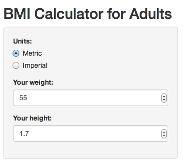
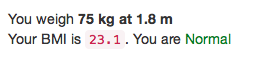

Shiny App: BMI Calculator for Adults
========================================================
author: Jenny
date: 21 June 2015

Developing Data Products Course Project

Introduction
========================================================

The Body Mass Index (BMI) is a common measure of body fat based on one's height and weight.

For this calculator, we intepretate the results based on the explanation given by the US Centres for Disease Control and Prevention.

- BMI < 18.5 = <span style='color: red'>Underweight</span>
- BMI 18.5 to 25.0 = <span style='color: green'>Normal</span>
- BMI 25.0 to 30.0 = <span style='color: orange'>Overweight</span>
- BMI > 30.0 = <span style='color: red'>Obese</span>

BMI Calculation
========================================================
- BMI = Weight (kg)/ Height(m)^2 , or
- BMI = Weight (lb) * 703 / Height (in)^2

For example, if one is 1.80m and 75kg, his BMI would be

```
[1] 23.14815
```
Therefore, he is 

```
[1] "Normal"
```

The Application
========================================================
The BMI calculator is published at https://jkyf.shinyapps.io/bmi-app

Here is a screenshot of the UI.



The Application (cont.)
=============
Here is a screenshot of the results produced as the user inputs his height and weight.



###### Disclaimer:
*All information provided is for educational purposes only. This information is ___NOT___ intended to replace any clinical judgment in any manner. Please seek professional help if you have any concerns about your health.*
